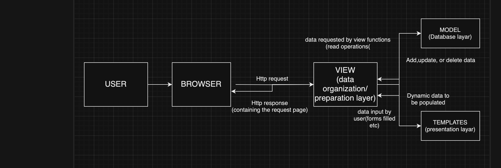
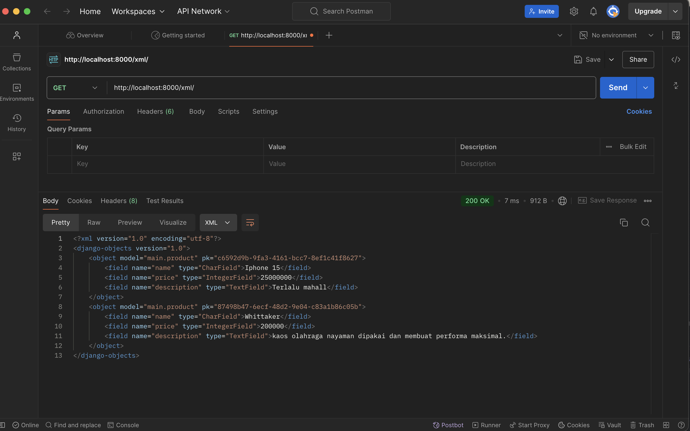
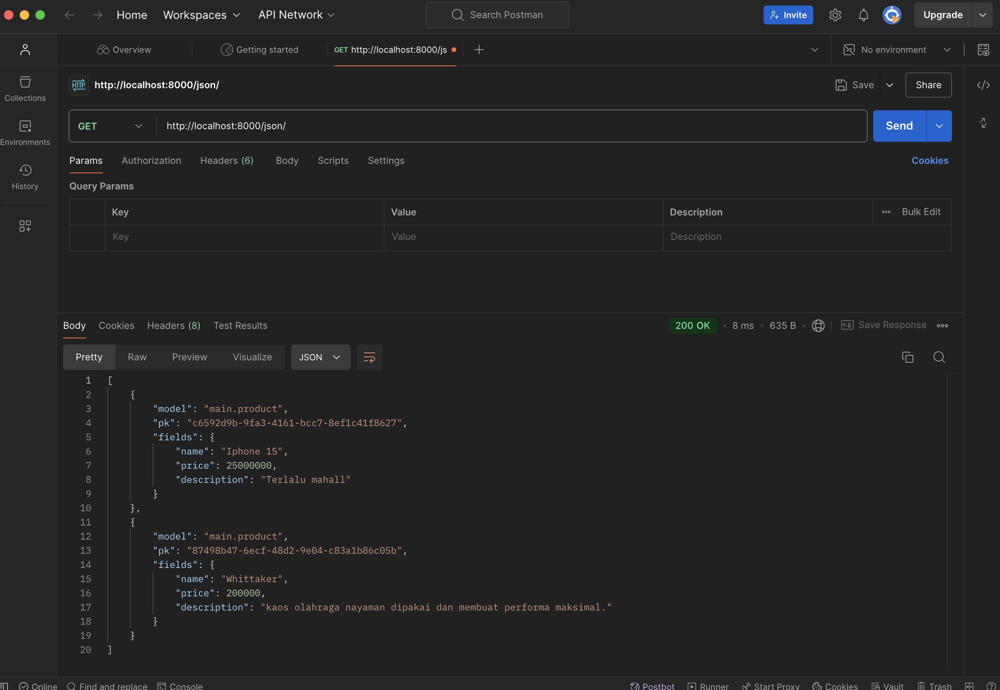
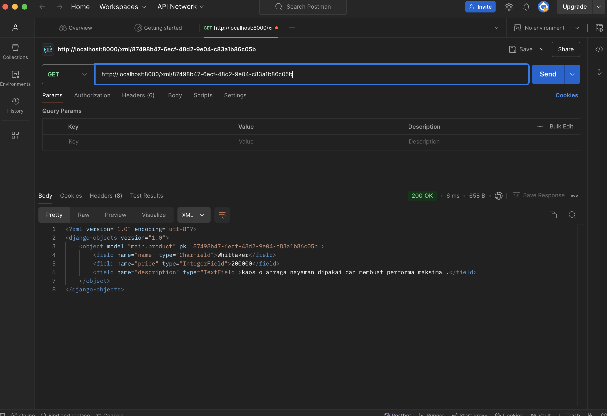
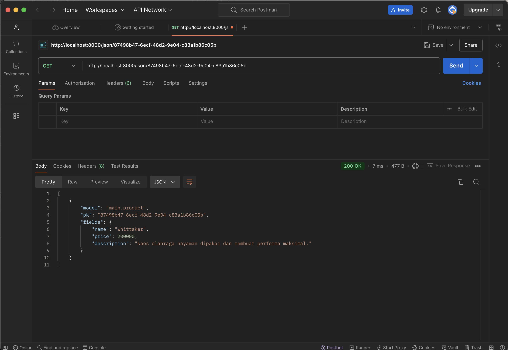
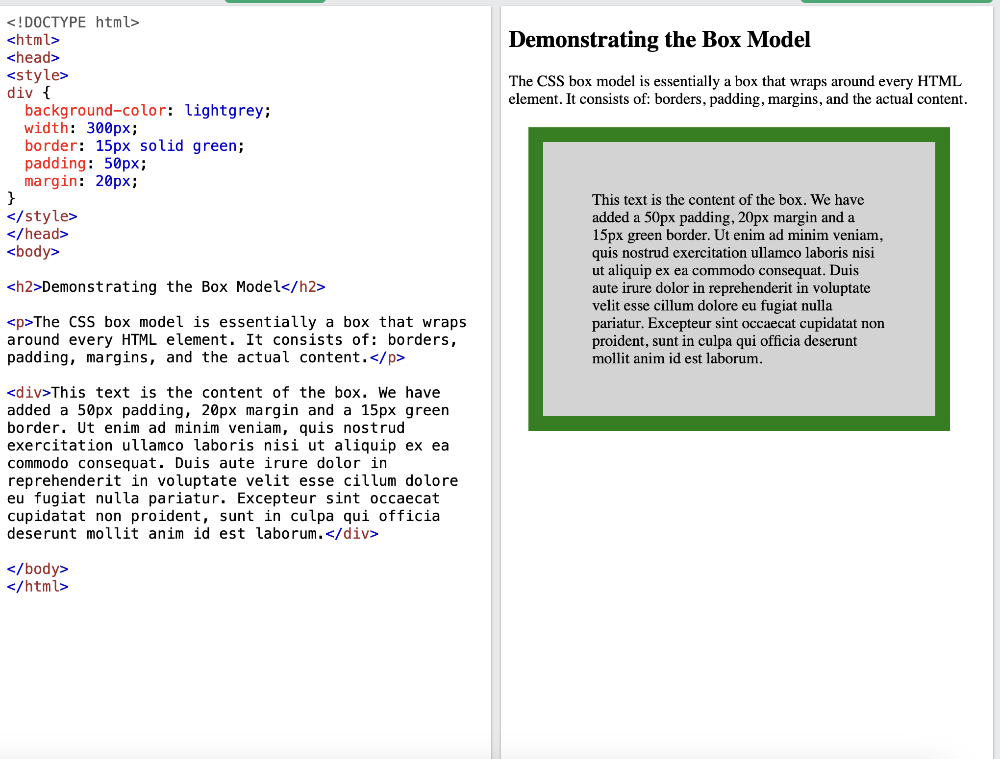

## Etoko - Farhan

## link: [http://farhan-dwi-etoko.pbp.cs.ui.ac.id](http://farhan-dwi-etoko.pbp.cs.ui.ac.id)

### Tugas 2

## Jelaskan bagaimana cara kamu mengimplementasikan checklist di atas secara step-by-step (bukan hanya sekadar mengikuti tutorial).
1. membuat dan mengaktifkan env
2. membuat file bernama requieremnt.txt dan menginstall nya ke dalam enviroment nya
3. lalu buat project tersebut dengan perintah startproject
4. buat aplikasi bernama main dengan perintah startapp
5. Mendaftarkan aplikasi main ke dalam proyek.
6. Membuat dan Mengisi Berkas main.html agar bisa menampilkan data yang diinginkan
7. Mengubah Berkas models.py dalam Aplikasi main
8. Membuat dan Mengaplikasikan Migrasi Model dengan          makemigratons dan migrate
9. membuat logic pada views
10. merender templates html agar bisa ditampikan di browser
11. membuat superuser agar dapat mengakses dashboard admin dan membuat contoh product
12. menjalankan perintah runserver agar web dapat dilihat
13. melakukan deployment ke PWS untuk dapat diakses melalui  internet

## Buatlah bagan yang berisi request client ke web aplikasi berbasis Django beserta responnya dan jelaskan pada bagan tersebut kaitan antara urls.py, views.py, models.py, dan berkas html.

pertama-tama user mengunjungi browser pada suatu link kemudian browser akan mengirimkan hhtp request,lalu urls pada django akan memanggil views yang berisi logika. views dapat memanggil model untuk memperoleh database.kemudian model akan mengirimkan data ke view. Lalu view akan menampilkan data dari model ke user dan menghubungkan dengan template. kemudian  template akan menampilkan tampilan antarmuka ke user yang dirender oleh views . dan terakhir views akan memberikan http respond ke browser yang berisi requested page.

 
## Jelaskan fungsi git dalam pengembangan perangkat lunak!
fungsi nya adalah sebagai sistem kontrol versi(version control system) untuk menyimpan,mengelola,dan berbagi kode
sumber secara efisien dan kolaboratif

## Menurut Anda, dari semua framework yang ada, mengapa framework Django dijadikan permulaan pembelajaran pengembangan perangkat lunak?
karena django mudah dipahami dan memiliki alur pemrograman yang cukup mudah sehingga cocok digunakan untuk orang yang baru belajar pemrograman berbasis web

## Mengapa model pada Django disebut sebagai ORM?
Orm merupakan sebuah teknik yang digunakan dalam pemrograman untuk basis data relasional sebagai penyimpanan data yang berupa objek. Model pada django disebut sebagai ORM karena teknik pemetaan data yang memungkinkan objek dalam program berbasis objek.Model pada django adalah sebuah represntasi tabel pada database.

### Tugas 3

## Jelaskan mengapa kita memerlukan data delivery dalam pengimplementasian sebuah platform?
karena untuk implementasi suatu form kita perlu mengirimkan data yang bermacam-macam bentuknya sesuai dengan kesepakatan. lalu,format data yang biasa dilakukan yaitu HTML,XML, dan JSON.

## Menurutmu, mana yang lebih baik antara XML dan JSON? Mengapa JSON lebih populer dibandingkan XML?
menurut saya lebih baik adalah json karena json lebih mudah dirubah  ke dalam javascript function sedangkan xml lebih susah dibandingkan json,lalu json lebih populer dibanding xml karena lebih cepat dan efisien, sebab baris yang terkandung dalam file json jauh lebih sedikit daripada format xml

## Jelaskan fungsi dari method is_valid() pada form Django dan mengapa kita membutuhkan method tersebut?
fungsinya adalah untuk memvalidasi form.kita membutuhkan itu untuk agar input dari user valid sebelum dimasukkan ke dalam database.

## Mengapa kita membutuhkan csrf_token saat membuat form di Django? Apa yang dapat terjadi jika kita tidak menambahkan csrf_token pada form Django? Bagaimana hal tersebut dapat dimanfaatkan oleh penyerang?
csrf token digunakan sebagai security pada aplikasi. jika csrf token tidak ditambahkan pada form django maka yang terjadi adalah muncul nya page forbidden 403 dan gagal melakukan verifikasi csrf sehingga data yang baru dimasukkan tidak berhasil ke database. penyerang dapat 
menambahkan csrf token sendiri yang dibuat seakan-akan 
otomatis oleh aplikasi.

## Jelaskan bagaimana cara kamu mengimplementasikan checklist di atas secara step-by-step (bukan hanya sekadar mengikuti tutorial).
1. kita mengimplentasikan base.html sebagai kerangka views
2. mengubah primary key dari integer menjadi UUID
3. membuat form input data dan menampilkan data pada html
4. menampilkan data dalam bentuk XML,JSON,XML by id, JSON by id
5. menggunakan postman untuk menampilkan data XML dan JSON
6. melakukan deployment otomatis ke pws menggunakan github action

### Tugas 4
1. Apa itu Django UserCreationForm, dan jelaskan apa kelebihan dan kekurangannya?
    django usercreationform adalah form bawaan django yang berguna untuk memudahkan developer dalam pembuatan form
  pendaftaran user dalam aplikasi karena form sudah di generate otomatis sesuai bawaan django. kelebihan nya adalah mudah dan praktis
  sedangkan kekurangan nya adalah kurang fleksibilitas sesuai yang diinginkan.misalnya adalah penentuan pembuatan username terbatas pada 
  ketentuan yang berlaku peraturan pembuatan password untuk validasi terbatas hanya pada username dan password

2. Apa perbedaan antara autentikasi dan otorisasi dalam konteks Django, dan mengapa keduanya penting?
    autentikasi adalah memverifikasi siapa user sedangkan otorisasi adalah menentukan seorang user yang terautentikasi dapat melakukan 
    sesuatu sesuai permission nya. pada sistem django autentikasi sudah mengandle keduanya. baik autentikasi ataupun otorisasi.

3.  Apa itu cookies dalam konteks aplikasi web, dan bagaimana Django menggunakan cookies untuk mengelola data sesi pengguna?
    cookies adalah salah satu cara untuk melakukan holding state dengan menggunakan session id. django menggunakan cookies untuk mengelola data sesi pengguna berdasarkan token pada session id. token tersebut berisi informasi dari user yang dapat dikenali pada sistem django.

4. Apakah penggunaan cookies aman secara default dalam pengembangan web, atau apakah ada risiko potensial yang harus diwaspadai?
    secara default dan pengembangan web cookies aman digunakan karena cookies hanya berisi bagian kecil data yang dikirimkan oleh server ke
    komputer pengguna . sedangkan untuk risiko yang perlu diwaspadai adalah ketika menggunakan komputer publik yang dapat diakses orang banyak,misalkan cookies masih ada di web browser informasi dapat dicuri.untuk menanggulangi nya dapat menggunakan incognito.

5.  Jelaskan bagaimana cara kamu mengimplementasikan checklist di atas secara step-by-step (bukan hanya sekadar mengikuti tutorial).?
    - pertama-tama kita membuat fungsi registrasi pada views.
    - lalu buat form dengan menggunakan html 
    - buat fungsi login pada views 
    - membuat form login menggunakan html
    - membuat fungsi logout pada views
    - menambahkan tombol untuk logout 
    - melakukan restriksi halaman dengan dekorator login require
    - menggunakan data dari cookies berguna untuk user tidak perlu login berulang kali setiap 
    refresh 
    - menghubungkan model dengan user berguna untuk mengetahui produk milik siapa dan dapat difilter sesuai dengan user yang login
    

## Tugas 5
1. Jika terdapat beberapa CSS selector untuk suatu elemen HTML, jelaskan urutan prioritas pengambilan CSS selector tersebut!
    ada 4 kategori dalam  selector css:
    - inline styles = selector yang berlangsung pada html tag. Example: <h1 style="color: pink;">
    - IDs = ID pada tag sebagai selector-nya. ID bersifat unik dalam satu halaman web. ID dapat ditambahkan pada halaman template HTML.  Example: #navbar
    - Classes, pseudo-classes, attribute selectors = untuk mengelompokkan elemen dengan karakteristik yang sama. Example: .test, :hover, [href]
    - Elements and pseudo-elements = Element Selector memungkinkan kita mengubah properti untuk semua elemen yang memiliki tag HTML yang sama.
      Example: h1
2. Mengapa responsive design menjadi konsep yang penting dalam pengembangan aplikasi web? Berikan contoh aplikasi yang sudah dan belum menerapkan responsive design!
    agar tampilan web menarik dan terlihat menyesuaikan dengan dimensi browser
    contoh yang udah menamipilkan responsive design: scele(https://scele.cs.ui.ac.id)
    contoh yang belom menamipilkan responsive design: deque university web (https://dequeuniversity.com/library/responsive/1-non-responsive)
3. Jelaskan perbedaan antara margin, border, dan padding, serta cara untuk mengimplementasikan ketiga hal tersebut!
    - Content: isi dari box (tempat terlihatnya teks dan gambar)
    - Padding: mengosongkan area di sekitar konten (transparan)
    - Border: garis tepian yang membungkus konten dan padding-nya
    - Margin: mengosongkan area di sekitar border (transparan)
    

4. Jelaskan konsep flex box dan grid layout beserta kegunaannya!
   
    Untuk membuat layout menggunakan Flexbox, kita menambahkan display: flex untuk mendefinikan Flexbox pada sebuah elemen dan flex-direction (untuk mengatur arah elemen : column atau row).
    sedangkan Untuk membuat layout menggunakan CSS Grid, kita menambahkan display: grid di sebuah elemen dan property grid(mengatur ukuran elemen) & grid-gap (untuk mengatur jarak antar elemen).

5. Jelaskan bagaimana cara kamu mengimplementasikan checklist di atas secara step-by-step (bukan hanya sekadar mengikuti tutorial)!
- konfigurasi menggunkan tailwind yang saya terapkan
- lalu kita membuat fitur edit product
- kemudian membuat fitur hapus product
- menambahkan navbar pada aplikasi dan dimasukkan ke dalam base html
- melakukan konfigurasi static file pada django
- menerapkan tailwind css dengan inline dan external
- menerapakan styling login,register,home, create product, dan edit product

## Tugas 6

1. Jelaskan manfaat dari penggunaan JavaScript dalam pengembangan aplikasi web!
    manfaat penggunaan nya adalah implementasi ajax,dan membuat aplikasi web menjadi lebih interaktif dengan adanya javascript

2. Jelaskan fungsi dari penggunaan await ketika kita menggunakan fetch()! Apa yang akan terjadi jika kita tidak menggunakan await?
    untuk mengimplmentasikan asinkronus yaitu fetch terlebih dahulu selesai, baru bisa dilanjutkan ke program selanjutnya, program dilakukan secara
    in order dari atas ke bawah tidak ada yang saling mendahului. apabila jika tidak menggunakan await yang terjadi program dibawah fetch tidak terekseskusi dengan baik karena hasil dari fetch blom tentu sudah didapat.
3. Mengapa kita perlu menggunakan decorator csrf_exempt pada view yang akan digunakan untuk AJAX POST?
    untuk membuat keamanan lebih kuat pada aplikasi web  ketika melakukan post request dengan menggunakan ajax.
4. Pada tutorial PBP minggu ini, pembersihan data input pengguna dilakukan di belakang (backend) juga. Mengapa hal tersebut tidak dilakukan di frontend saja?
    hal ini dilakukan oleh backend juga karena untuk memperkuat keamanan pada backend. karena jika hacker mencoba untuk meretas ke backend
    hacker tersebut tidak berhasil karena sudah dihandle

5. Jelaskan bagaimana cara kamu mengimplementasikan checklist di atas secara step-by-step (bukan hanya sekadar mengikuti tutorial)!
    - menambahkan fungsi untuk menambahkan product dengan AJAX
    - menambahkan routing untuk fungsi product AJAX
    - menampilkan data product dengan menggunakan fetch API 
    - membuat form berbentuk modal untuk mengimplemntasikan create product dengan ajax
    -  mengimplementasikan refresh otomatis tanpa reload dengan AJAX
    - mengimplementasikan cross site scripting atau XSS pada backend
    - membersihkan data dengan DOMPurify pada frontend
